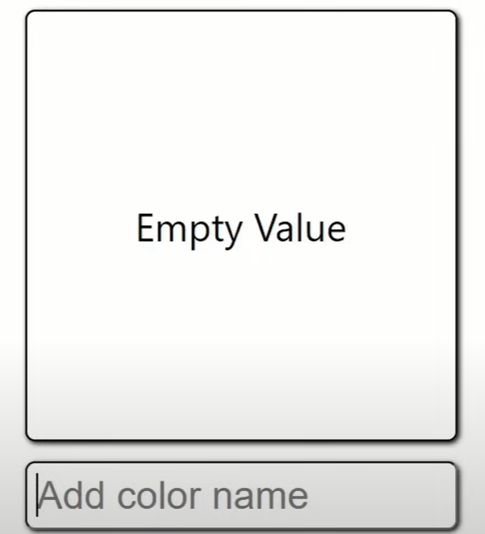

### Getting Started with the GIT
[Link](https://www.freecodecamp.org/news/practical-git-and-git-workflows/)

[History of React by its creators](https://www.youtube.com/watch?v=8pDqJVdNa44&t=5s)

[Every React Concept Explained in 12 Minutes](https://www.youtube.com/watch?v=wIyHSOugGGw&t=315s)

[Every React 19 Feature Explained in 8 Minutes](https://www.youtube.com/watch?v=2NPIYnY3ilo)

[ALL React Hooks Explained in 12 Minutes](https://www.youtube.com/watch?v=LOH1l-MP_9k)

Difference between Framework and a Library
What is SPA (Single Page Application)

[Setup the sms notifications](https://www.twilio.com/code-exchange/sms-notifications)

[API](https://medium.com/@jjensi632/what-is-api-ef265bb40b8c)

[API](https://www.ibm.com/topics/api)

[API Types and use cases](https://konghq.com/blog/learning-center/different-api-types-and-use-cases)
### Here is a high-level overview of several types of API methods:

###### GET method: retrieves information or data from a specified resource
###### POST method: submits data to be processed to a specified resource
###### PUT method: updates a specified resource with new data
###### DELETE method: deletes a specified resource

## Assignment 

### First
Convert the Booking(TripZila) or any previously completed project's Index page into react page using Components. 
### Second
Convert the Booking(TripZila) into a react based SPA using router.
### Third
Bring the list of monkeys in the <Main/> component using the map function

The json can be picked up using the following [monkey json](https://raw.githubusercontent.com/jamesmontemagno/app-monkeys/master/MonkeysApp/monkeydata.json)
#### Output: 

### Fourth

Add a monkey the way we added the the new item in the groceries list.
or
You can use jobzila to add job in the list of jobs.

### Fifth
Create a color picker where you can type the color name and above label/textbox gets filled with that color. 

### Sixth
Pickup a simple project in react like a to do list or portfolio from youtube.

## Reading Assignments:

### Spread Operator
[Link1](https://www.freecodecamp.org/news/javascript-spread-and-rest-operators/)
[Link2](https://www.w3schools.com/react/react_es6_spread.asp)
[Link3](https://developer.mozilla.org/en-US/docs/Web/JavaScript/Reference/Operators/Spread_syntax)

### Arrow Functions
[Link1](https://developer.mozilla.org/en-US/docs/Web/JavaScript/Reference/Functions/Arrow_functions
)
[Link2](https://www.w3schools.com/js/js_arrow_function.asp)
[Link1](https://www.freecodecamp.org/news/javascript-arrow-functions-in-depth/)

###  Conditional (ternary) operator   
[Link1](https://developer.mozilla.org/en-US/docs/Web/JavaScript/Reference/Operators/Conditional_operator)
[Link2](https://www.w3schools.com/react/react_es6_ternary.asp)
[Link1](https://www.freecodecamp.org/news/the-ternary-operator-in-javascript/)

### Destructuring assignment
[Link1](https://developer.mozilla.org/en-US/docs/Web/JavaScript/Reference/Operators/Destructuring_assignment)
[Link1](https://www.w3schools.com/react/react_es6_destructuring.asp)
[Link1](https://www.freecodecamp.org/news/array-vs-object-destructuring-in-javascript/)

### CRUD operation 
[CRUD](https://www.freecodecamp.org/news/crud-operations-explained/)
