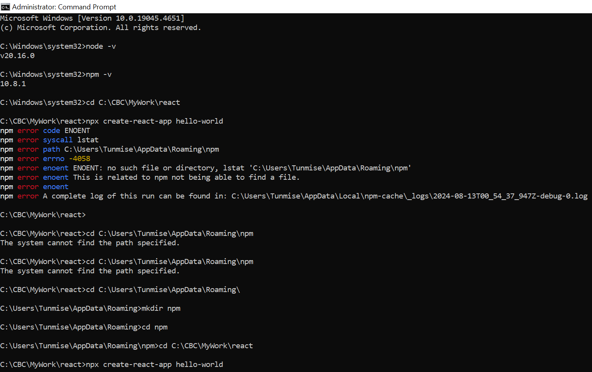

# React Official Documentation

[React Documentation](https://react.dev/)

React is a JS Library
Created at Facebook
Open source in 2013

---code editors
# Chrome extension 
[react-developer-tools](https://chromewebstore.google.com/detail/react-developer-tools/fmkadmapgofadopljbjfkapdkoienihi)

After installing go to browser's settings ---extension ---select react-dev-tools ------check Allow access to file URLs

[React Sandbox](https://codesandbox.io/p/sandbox/react-new?utm_source=dotnew)

--react.new in the url--

# VS Code extension

[ES7+ React/Redux/React-Native snippets](https://marketplace.visualstudio.com/items?itemName=dsznajder.es7-react-js-snippets)

# Node
[Node Setup](https://nodejs.org/en/download/prebuilt-installer)

To Check the installation run
>node -v
>npm -v

# Create React App

To learn and test React, you should set up a React Environment on your computer.
This tutorial uses the create-react-app.
The create-react-app tool is an officially supported way to create React applications.
[Node.js](https://nodejs.org/en/download/prebuilt-installer) is required to use create-react-app.
Open your terminal in the directory you would like to create your application.
Run this command to create a React application named my-react-app:

>npx create-react-app my-react-app

# Error Running npx create-react-app

# Error Running npx start

