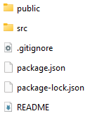
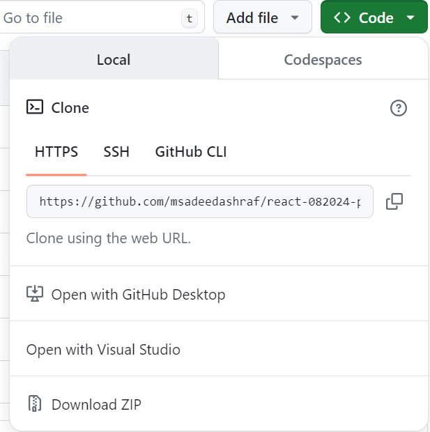
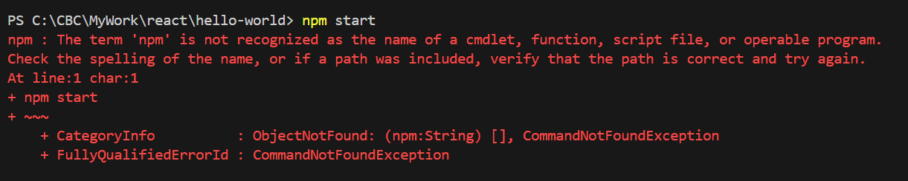
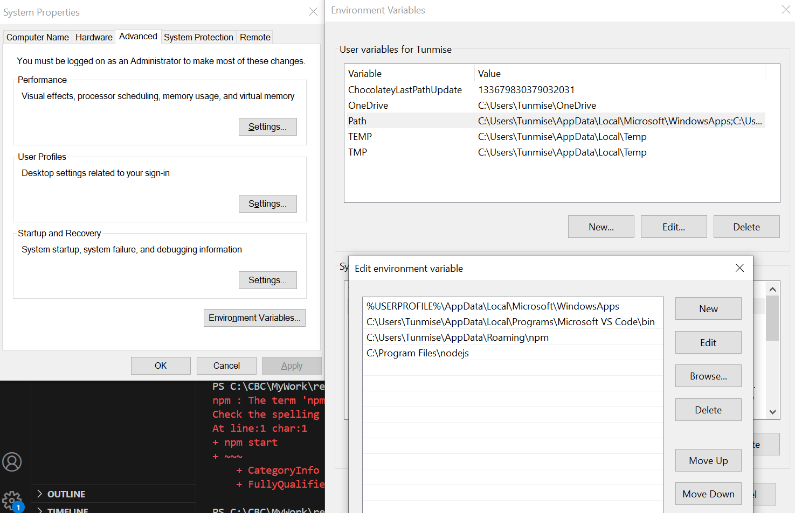

# React Official Documentation

[React Documentation](https://react.dev/)

React is a JS Library
Created at Facebook
Open source in 2013

---code editors
# Chrome extension 
[react-developer-tools](https://chromewebstore.google.com/detail/react-developer-tools/fmkadmapgofadopljbjfkapdkoienihi)

After installing go to browser's settings ---extension ---select react-dev-tools ------check Allow access to file URLs

[React Sandbox](https://codesandbox.io/p/sandbox/react-new?utm_source=dotnew)

--react.new in the url--

# VS Code extension

[ES7+ React/Redux/React-Native snippets](https://marketplace.visualstudio.com/items?itemName=dsznajder.es7-react-js-snippets)

# Node
[Node Setup](https://nodejs.org/en/download/prebuilt-installer)

To Check the installation run

>node -v

>npm -v

# Create React App

To learn and test React, you should set up a React Environment on your computer.
This tutorial uses the create-react-app.
The create-react-app tool is an officially supported way to create React applications.
[Node.js](https://nodejs.org/en/download/prebuilt-installer) is required to use create-react-app.
Open your terminal in the directory you would like to create your application.
Run this command to create a React application named my-react-app:

### Option 1

>npx create-react-app app_name

>cd app_name

>npm start

### Option 2
Create a project folder 

> npx create-react-app .

> npm start  

### Option 3
Create a project folder and bring the files in that folder 

> cd your_path [drag and drop the folder in VS Code terminal]

> npm install

> npm start  

### Option 4
Connecting the code from the Git Repo

Create a folder in the local machine (class-code)

Open the folder with VS Code 

Pickup the Terminal

git clone repo_url 

> git clone https://github.com/msadeedashraf/react-082024-pm.git

To get the updates/New Files

> git fetch

> git pull

# Error Running npx create-react-app

# Error Running npx start
 

### To set/edit the environment variables

# To create a Component 
create a .js file and type rafce

### How to use Routes

[Using Routes](https://www.freecodecamp.org/news/how-to-use-react-router-version-6/
)

<Routes>
<Route path="/" element={  } />
<Route path="about" element={ } />
<Route path="contact" element={} />
</Routes>

# To Install the React Router
On the terminal type 

>npm install react-router-dom

